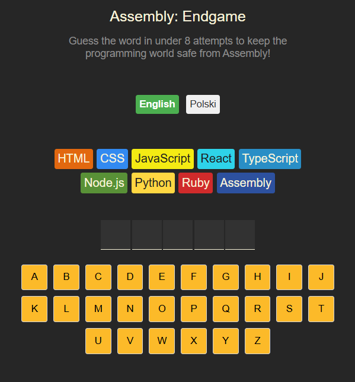
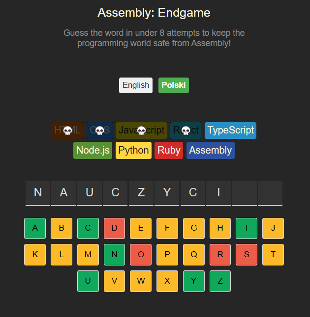
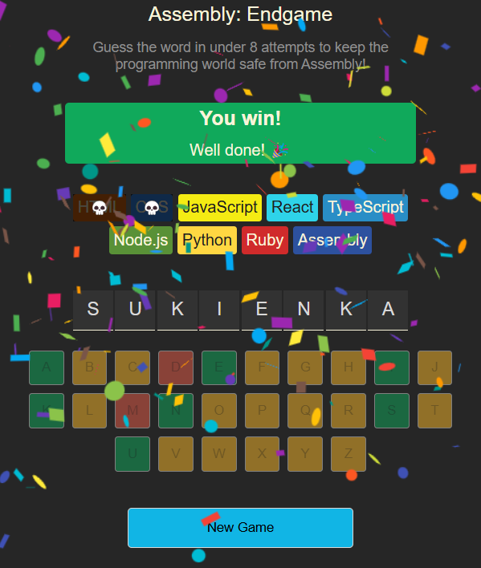
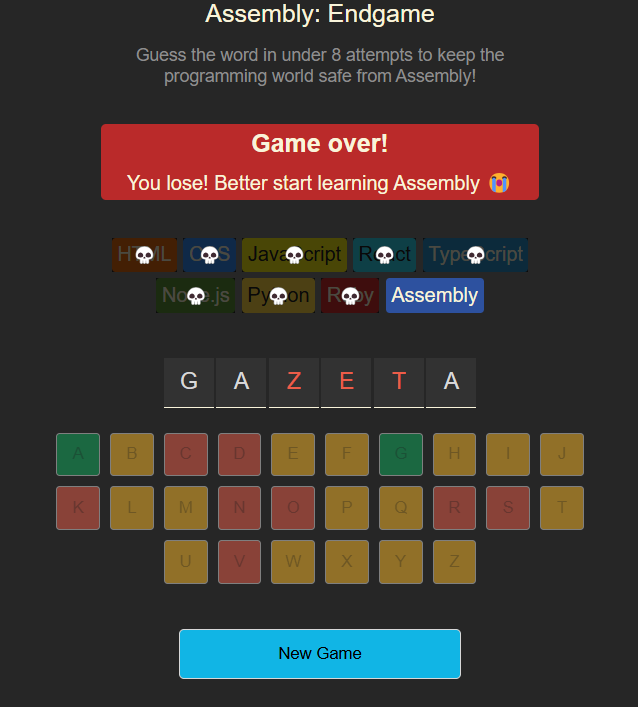

# Assembly: Endgame

🚀 **Assembly: Endgame** to interaktywna gra w zgadywanie słów w stylu wisielca, w której masz 8 prób, aby odgadnąć losowe słowo. Każda błędna litera eliminuje jeden język programowania – nie pozwól, by Assembly przejął kontrolę! 🔥

## 🚀 Demo
Aplikacja jest hostowana na **GitHub Pages**. Możesz ją zobaczyć tutaj:
[➡ Zagraj w Assembly: Endgame](https://kolodziejmateusz.github.io/Assembly-Endgame-Word-Guess/)

## ✨ Funkcje
- Obsługa dwóch języków: 🇬🇧 Angielski i 🇵🇱 Polski
- Losowe słowa do odgadnięcia
- Eliminacja jezyków programowania i wyświetlanie zabawnego tekstu po każdej nietrafionej próbie
- Animacje konfetti po wygranej 🎉
- Estetyczny interfejs z dynamiczną zmianą kolorów

## 🎮 Jak grać?
1. **Wybierz język** (English / Polski) 🌍
2. **Zgaduj litery** – klikaj na klawiaturze ekranowej 🔠
3. **Kolory podpowiadają:**
   - 🟩 **Zielony** – poprawna litera
   - 🟨 **Żółty** – niekliknięta litera
   - 🟥 **Czerwony** – nietrafiona litera
4. **Utrzymuj języki przy życiu**! 💀 Czaszki oznaczają eliminację technologii
5. **Wygraj lub przegraj** – jeśli nie odgadniesz na czas, pora nauczyć się Assembly! 🤖

## ⚙️ Technologie
- ⚛ **React** – podstawowy framework
- 🟨 **JavaScript** 
- 🎨 **CSS** – stylowanie aplikacji
- 🎉 **React-Confetti** – animacje konfetti po wygranej
- 📏 **clsx** – dynamiczne klasy CSS

## 🖼️ Zrzuty ekranu

1. **Ekran startowy**

   

2. **W trakcie gry**

   

3. **Wygrana**

   

4. **Przegrana**

   

